# Anatomi CSS
## kode program
```css
P {
Color: red;
}
```
## Penjelasan
- Tag `<p>` adalah selector yang ingin di modifikasi.
- property adalah `color` pada komponen textnya
- property values adalah `red` kita mau modifikasi seperti apa warnanya
## Kesimpulan
warna teks (text color) dari elemen HTML yang memiliki tag P akan diubah menjadi merah (red).
# percobaan pertama
## kode css
```css
p {
	color: red;
}
```
## Hasil
### before
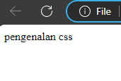
### after
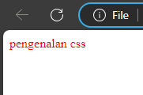
## penjelasan
Kode CSS di atas `p { color: red; }` memiliki arti bahwa semua elemen HTML dengan tag `<p>` (paragraf) akan memiliki warna teks merah. Ini berarti setiap teks yang ada di dalam elemen `<p>` akan ditampilkan dengan warna merah.
Jadi, kesimpulan dari kode program tersebut adalah bahwa semua teks di dalam elemen paragraf `<p>` akan ditampilkan dengan warna merah.
# percobaan kedua
## kode css
```css
 button {
      width: 150px;
      height: 50px;
      text-transform: uppercase;
      font-size: 20px;
      padding-left: 20px;
    }
```

## text - transform
### Before
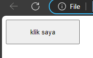
### After
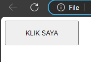
### Penjelasan 
Properti `text-transform: uppercase;` dalam CSS digunakan untuk mengubah semua karakter teks di dalam elemen menjadi huruf kapital besar. Ini berarti bahwa tidak peduli bagaimana teks itu awalnya ditulis, itu akan ditampilkan dalam huruf kapital. Misalnya, jika teks aslinya adalah "klik aku!", dengan menggunakan `text-transform: uppercase;`, teks tersebut akan ditampilkan sebagai "KLIK AKU!".
### kesimpulan
Dengan kode CSS tersebut, semua teks dalam elemen akan ditampilkan dalam huruf kapital,
berguna jika Anda ingin memastikan bahwa teks tertentu ditampilkan dalam huruf kapital, terlepas dari bagaimana teks itu ditulis dalam kode HTML.
## Font -  size
### Before

### After
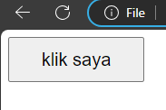

### Penjelasan
Properti `font-size` dalam CSS digunakan untuk menentukan ukuran font teks dalam elemen yang dipilih. Ini memungkinkan pengaturan ukuran font untuk teks di dalam elemen HTML, dan dapat diatur dalam berbagai unit pengukuran seperti piksel (px), em, atau persen (%), di antara yang lain.
### kesimpulan
font-size: 20px ini adalah ukuran teks yang digunakan dalam desain web atau pengaturan tata letak halaman. Ukuran 20px adalah ukuran yang cukup besar untuk teks, membuatnya mudah dibaca oleh pengguna. Namun, ukuran teks yang tepat untuk digunakan tergantung pada desain keseluruhan situs web atau halaman, serta preferensi pengguna dan kebutuhan konten.
## Padding life
### Before

### After
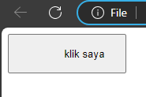
### Penjelasan
Properti `padding-left` dalam CSS digunakan untuk menentukan jarak atau ruang (padding) yang akan diberikan di sebelah kiri isi dari suatu elemen. Padding adalah ruang tambahan di sekeliling isi elemen, yang membantu mengatur jarak antara isi elemen dan batas atau tepi elemen itu sendiri.
### penjelasan
penggunaan padding-left: 20px adalah untuk memberikan ruang kosong sebesar 20 piksel di sebelah kiri elemen yang bersangkutan, yang dapat berguna untuk menciptakan tata letak yang lebih rapi dan terorganisir dalam desain halaman web.
 
# Deklarasi pemanggilan css
## eksternal
### penjelasan
Deklarasi pemanggilan CSS eksternal adalah cara untuk menghubungkan file CSS eksternal ke dalam halaman web HTML. Ini memungkinkan Anda untuk memisahkan gaya (styling) dari struktur (markup) dan perilaku (behavior) halaman web Anda. Dengan menggunakan file CSS eksternal, Anda dapat dengan mudah mengubah tata letak, warna, ukuran font, dan gaya lainnya di seluruh situs web hanya dengan mengedit satu file.
### kode program
```html
<html>
<head>
    <title>Contoh Eksternal CSS</title>
    <link rel="stylesheet" type="text/css" href="style-ku.css">
</head>
<body>
    <h2>Ini judul artikel</h2>
    <p>Ini adalah paragraf yang memuat isi artikel.</p>
</body>
</html>
```
## inline
### penjelasan 
Deklarasi pemanggilan CSS inline adalah cara untuk menambahkan gaya CSS langsung ke dalam elemen HTML tertentu, bukan menggunakan file eksternal atau tag `<style>` terpisah. Ini bisa berguna dalam situasi di mana Anda ingin menetapkan gaya khusus untuk satu elemen tanpa harus membuat aturan CSS baru atau menambahkan gaya ke dalam file eksternal.
### kode program
```html
<html>
<head>
  <title>Contoh Inline CSS</title>
</head>
<body>
  <h2 style="color:red;font-family:sans">Ini judul artikel</h2>
  <p style="color:maroon">Ini adalah paragraf yang memuat isi artikel.</p>
</body>
</html>
```
## internal
### penjelasan
Deklarasi internal CSS mengacu pada pendefinisian gaya CSS secara langsung di dalam dokumen HTML menggunakan tag `<style>`. Metode ini memungkinkan Anda menentukan presentasi dan tata letak elemen HTML dalam file yang sama, daripada menautkan ke file CSS eksternal.
### kode program
```html
 ```html
<html>
<head>
  <title>Contoh Internal CSS</title>
  <!-- penulisan internal css dalam tag head -->
  <style type="text/css">
    p{
      font-family: serif;
      line-height: 1.75em;
      font-size: 18px;
    }
    i { 
      font-family: sans;
      color: orange;
    }
  </style>
</head>
<body>
  <!-- penulisan internal css dalam tag body -->
  <style type="text/css">
    h2 { 
      font-family: sans;
      color: #333;
    }
  </style>
  <h2>Ini judul artikel</h2>
  <p>Ini adalah paragraf yang memuat isi artikel.</p>
</body>
</html>
```
# selector
## elemen selector
### penjelasan
Elemen selector adalah bagian penting dalam CSS (`Cascading Style Sheets`) yang memungkinkan Anda menargetkan elemen HTML tertentu untuk diberikan gaya atau styling. Dengan menggunakan elemen selector, Anda dapat mengidentifikasi dan memilih elemen HTML spesifik berdasarkan tipe elemennya. Ini membantu Anda menerapkan gaya tertentu pada bagian-bagian khusus dari halaman web Anda.
### kode program
```css
p { font-size: 18px;
}
```
### hasil
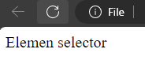
# Text
## Text align
### penjelasan
`text-align` pada CSS digunakan untuk mengatur posisi horizontal teks di dalam sebuah elemen. Properti ini dapat memiliki beberapa nilai, di antaranya:
- `text-align:left` ; Text akan ditampilkan di sebelah kiri dokumen.
- `text-align:right` ; Text akan ditampilkan di sebelah kanan dokumen.
- `text-align:center `; Text akan ditampilkan di tengah-tengah dokumen.
- `text-align:justify` ; Text akan ditampilkan dengan mengikuti spasi yang ada di antara kata-kata.
### kode program
```css
p {
text-align: center;
}
```
### hasil
#### before
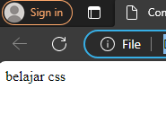
#### after
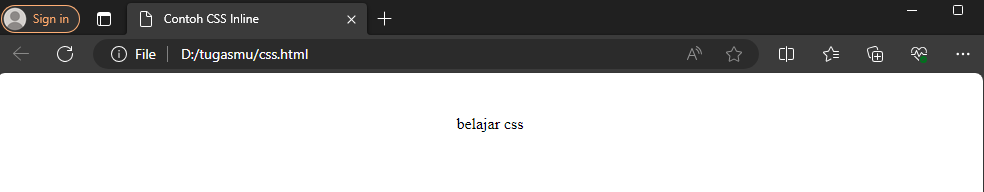
### kesimpulan 
dari kode program yang diberikan `p { text-align: center; }` adalah bahwa kode ini mengatur properti CSS `text-align` untuk elemen `<p>` (paragraf) dalam sebuah dokumen HTML. Dengan nilai `center`, semua teks dalam elemen `<p>` akan diatur ke tengah dari elemen tersebut.
Jadi, jika Anda menggunakan kode ini dalam dokumen HTML, semua teks dalam elemen `<p>` akan ditampilkan dengan rata tengah. 
## Text decoration
### penjelasan
`text-decoration` adalah properti CSS yang digunakan untuk mengatur dekorasi teks seperti garis melintang, garis bawah, garis atas, dan garis tepi.
Berikut adalah beberapa nilai yang dapat digunakan untuk properti `text-decoration`:
- `none` : menghilangkan dekorasi garis pada teks (pilihan default).
- `underline` : menambahkan garis bawah pada teks.
- `overline` : menambahkan garis atas pada teks.
- `line-through` : menambahkan garis horizontal yang menembus tengah teks, sehingga tampak tercoret.
### kode program
```css
p {
text-decoration: underline;
}
```
### hasil
#### before

#### after
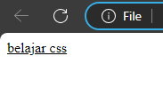
### kesimpulan
dari kode program tersebut adalah bahwa semua elemen `<p>` (paragraf) dalam dokumen HTML akan ditampilkan dengan dekorasi garis melintang (`line-through`) pada teksnya. Artinya, teks di dalam setiap elemen `<p>` akan memiliki garis melintang di atasnya saat ditampilkan di browser.
## Text transform
### penjelasan
`text-transform` digunakan untuk mengontrol transformasi teks dalam elemen HTML. Properti ini memungkinkan Anda untuk mengubah tampilan teks, seperti membuatnya menjadi huruf kapital, huruf kecil, atau mengubah huruf pertama setiap kata menjadi huruf besar (kapital).
Berikut adalah nilai-nilai yang dapat digunakan untuk properti `text-transform`:
- `none (default)`: Menjaga kapitalisasi teks seperti pada penulisan aslinya.
- `uppercase` : Mengubah semua huruf menjadi huruf besar (uppercase).
- `lowercase`: Mengubah semua huruf menjadi huruf kecil (lowercase).
- `capitalize` : Mengubah huruf pertama setiap kata menjadi huruf besar (capitalize), mirip gaya penulisan judul.
### kode program 
```css
p {
text-transform: uppercase;
}
```
### hasil
#### before

#### after
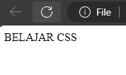
### kesimpulan
Kode program di atas menunjukkan bahwa teks di dalam elemen dengan tag `<p>` akan ditampilkan dalam huruf kapital (`uppercase`).Jadi, kode program tersebut adalah bahwa semua teks di dalam elemen `<p>` akan ditampilkan dalam huruf kapital atau huruf besar.
## Text indent
### penjelasan
Text indent atau indentasi teks adalah proses membuat jarak antara teks dengan margin atas dari sebuah paragraf. Ini dapat membuat teks terlihat lebih rapi dan terstruktur. Teks dapat diatur dengan menggunakan tanda indentasi seperti tab atau spasi.
### kode program 
```css
p {
text-indent: 100px;
}
```
### hasil
#### before

#### after
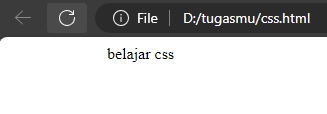
### kesimpulan
Kode program di atas menunjukkan bahwa elemen dengan tag `<p>` akan memiliki `indentasi` teks sebesar 100 piksel dari margin kiri. Ini berarti bahwa setiap paragraf dalam elemen `<p>` akan dimulai dengan jarak atau `indentasi` sebesar 100 piksel dari sisi kiri halaman atau elemen yang mengandungnya.
Jadi, kesimpulan dari kode program tersebut adalah bahwa setiap paragraf dalam elemen `<p>` akan dimulai dengan `indentasi` teks sebesar 100 piksel dari margin kiri.
## Letter spacing
### penjelasan
Letter spacing merujuk pada jarak horizontal antara huruf-huruf dalam sebuah teks. kata lain, letter spacing mengontrol seberapa dekat atau berjauhan huruf-huruf tersebut ditempatkan satu sama lain.
### kode program
```css
p {
letter-spacing: 50px;
}
```
### hasil
#### before

#### after
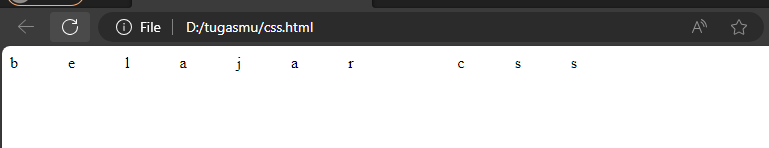
### kesimpulan
Kode program di atas menunjukkan bahwa elemen dengan tag `<p>` akan memiliki jarak antar huruf sebesar 50 piksel (`letter-spacing: 50px;`). Ini berarti teks di dalam elemen tersebut akan ditampilkan dengan jarak yang lebih lebar antar hurufnya.
Jadi, kesimpulan dari kode program tersebut adalah bahwa semua teks di dalam elemen `<p>` akan ditampilkan dengan jarak antar huruf sebesar 50 piksel.
## Line height
### penjelasan
Line height adalah properti dalam CSS yang menentukan *jarak vertikal* antara baris teks dalam sebuah elemen, biasanya elemen paragraf (`<p>`).
### kode program
```css
p {
line-height: 150px;
}
```
### hasil
#### before

#### after
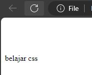
### kesimpulan
Kode program di atas menunjukkan bahwa semua elemen dengan tag `<p>` akan memiliki tinggi baris (`line-height`) sebesar 150 piksel. Ini berarti jarak antara garis teks di dalam elemen `<p>` akan diperbesar menjadi 150 piksel.f
Dengan demikian, kesimpulan dari kode program tersebut adalah bahwa semua teks di dalam elemen `<p>` akan memiliki jarak antarbaris sebesar 150 piksel. Hal ini dapat mempengaruhi tata letak dan penampilan teks di dalam elemen tersebut. Semakin besar nilai `line-height`, semakin besar pula jarak antarbarisnya.
## Word spacing
### penjelasan
Word spacing merujuk pada pengaturan jarak antara kata dalam teks.
### kode program
```css
p {
word-spacing: 150px;
}
```
### hasil
#### before

#### after
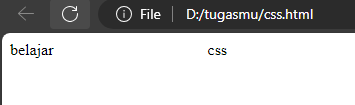
### kesimpulan
Kode program tersebut, `p { word-spacing: 150px; }`, akan memberikan spasi antara kata-kata di dalam elemen `<p>` sebesar 150 piksel.
Jadi, kesimpulan dari kode program tersebut adalah bahwa semua kata di dalam elemen `<p>` akan memiliki jarak antar kata sebesar 150 piksel. Ini berarti bahwa setiap kata akan terpisah dengan jarak yang cukup besar, membuatnya terlihat lebih terpisah dalam tampilan teks tersebut.

# Background
## Background color
### penejelasan
`background-color` adalah sebuah properti CSS yang digunakan untuk menentukan warna latar belakang dari suatu elemen HTML. Properti ini dapat digunakan untuk mengubah warna latar belakang dari berbagai elemen, seperti halaman web, bagian dari halaman web (seperti div atau paragraf), tombol, kotak, dan lain sebagainya.
###  kode program
```Css
body {
	background-color: aqua;
}
```
### hasil
#### before
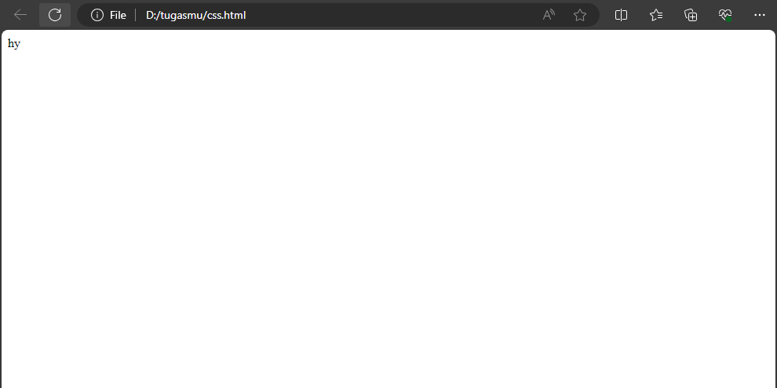
#### after
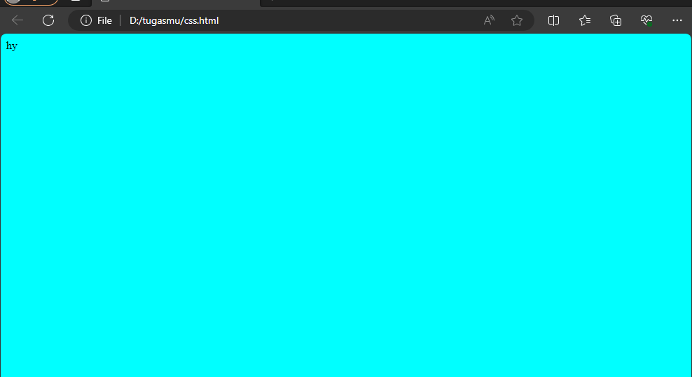
### kesimpulan
Kode program di atas menunjukkan bahwa tombol (elemen dengan tag `<button>`) akan memiliki latar belakang berwarna ungu (`aqua`). Dengan demikian, kode program tersebut adalah bahwa semua tombol di halaman web akan memiliki latar belakang berwarna ungu.
## Background-image
### penjelasan
Background image adalah gambar yang digunakan sebagai latar belakang di halaman web, aplikasi, atau dokumen digital lainnya.
### kode program
```css
body {
background-image: url("3.jpg");
}
```
### hasil
#### before

#### after
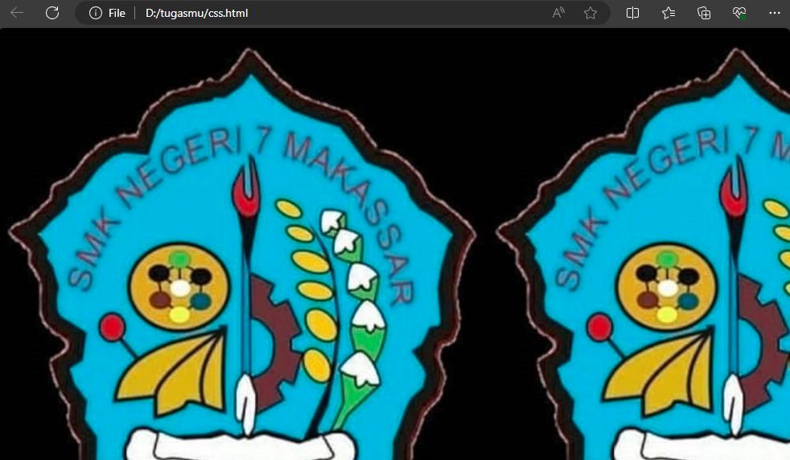
### kesimpulan
Kode program di atas menunjukkan bahwa latar belakang (`background`) dari elemen `<body>` akan menggunakan gambar dengan nama file` "3.jpg"` sebagai background image.
kesimpulan dari kode program tersebut adalah bahwa latar belakang dari halaman web atau dokumen HTML akan ditampilkan dengan gambar `"3.jpg"` sebagai background image.
## Background-repeat
### penjelasan
Background-repeat digunakan untuk mengatur bagaimana sebuah gambar background akan diulang atau tidak diulang.
### kode program
```css
body {
background-repeat: no-repeat;
}
```
### hasil
#### before

#### after
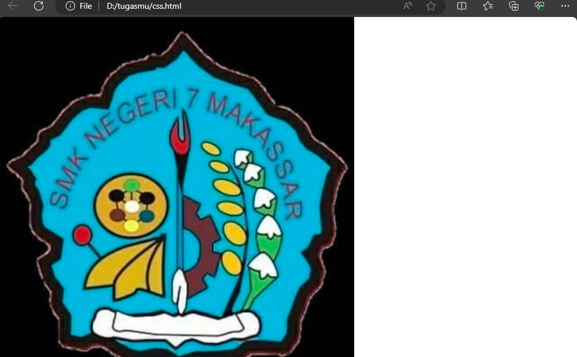
### kesimpulan
Kode program di atas menunjukkan bahwa gambar latar belakang pada halaman HTML tidak akan diulang atau diulang (`background-repeat: no-repeat`). Ini berarti gambar latar belakang akan ditampilkan sekali saja di dalam area halaman, dan tidak akan diulang baik secara horizontal maupun vertikal.
Jadi, kesimpulan dari kode program tersebut adalah bahwa gambar latar belakang pada halaman HTML akan ditampilkan sekali saja, tanpa diulang baik secara horizontal maupun vertikal.
## Background-attachment
### penjelasan
Background-attachment digunakan untuk mengatur bagaimana sebuah gambar background akan bergerak atau tidak bergerak dalam halaman.
### kode program
```css
body { 
background-attachment: fixed; 
}
```
### hasil
#### before
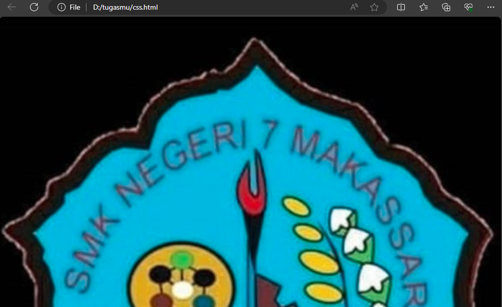
#### after
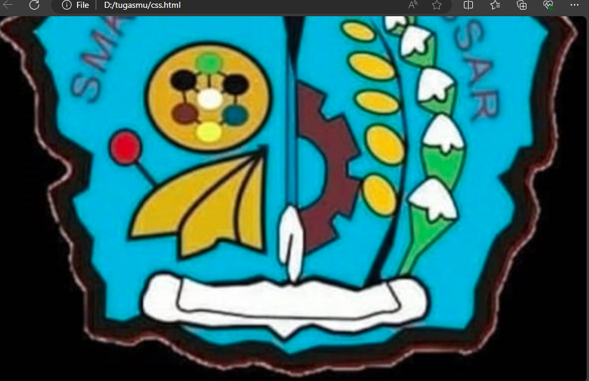
### kesimpulan
Kode CSS di atas, `body { background-attachment: fixed; }`, menetapkan bahwa gambar latar belakang pada halaman HTML akan memiliki sifat tetap (`fixed`). Ini berarti gambar latar belakang akan tetap pada posisinya relatif terhadap jendela browser, dan tidak akan bergerak saat halaman digulir.
Jadi, kesimpulan dari kode tersebut adalah bahwa gambar latar belakang pada halaman HTML akan memiliki sifat tetap dan tidak akan bergerak saat halaman digulir.
## Background-size
### penjelasan
`background-size` adalah properti dalam CSS yang digunakan untuk mengontrol ukuran dari gambar latar belakang pada suatu elemen. Properti ini memungkinkan Anda untuk menentukan seberapa besar gambar latar belakang akan ditampilkan di dalam elemen tersebut.
### kode program
```css
body {
background-size: 300px 200px;
}
```
### hasil
#### before
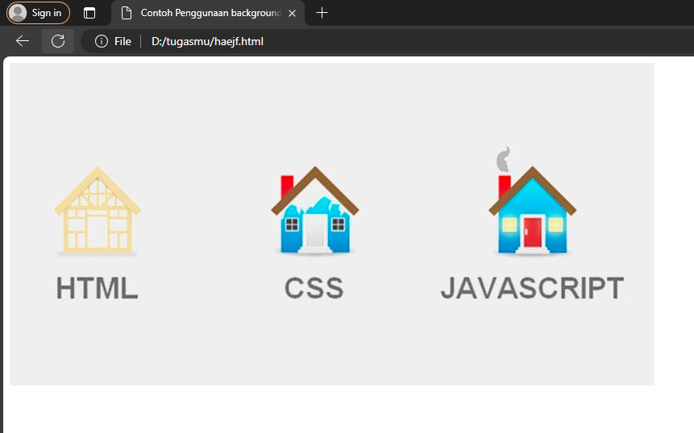
#### after
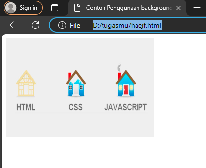
### kesimpulan
Kode CSS di atas menunjukkan bahwa gambar latar belakang pada halaman HTML akan ditampilkan dengan ukuran 200 piksel lebar dan 300 piksel tinggi (`background-size: 200px 300px;`).
Jadi, kesimpulan dari kode program tersebut adalah bahwa gambar latar belakang pada halaman HTML akan diberikan ukuran 200 piksel lebar dan 300 piksel tinggi.

## Background-position
### penjelasan
`background-position` adalah properti dalam CSS yang digunakan untuk mengatur posisi dari gambar latar belakang pada sebuah elemen. Properti ini memungkinkan Anda untuk menentukan di mana gambar latar belakang akan ditampilkan di dalam elemen tersebut.
Berikut adalah beberapa nilai yang bisa digunakan untuk properti `background-position`:
1. Nilai dalam persentase (misalnya `50% 25%`): Anda bisa menentukan posisi horizontal dan vertikal gambar latar belakang dengan nilai dalam persentase dari ukuran elemen tersebut. Contoh: `background-position: 50% 25%;` akan menempatkan gambar latar belakang di tengah horizontal dan 25% dari atas.
2. Nilai dalam satuan piksel (misalnya `10px 20px`): Anda juga bisa menentukan posisi gambar latar belakang secara eksplisit dengan nilai dalam satuan piksel. Contoh: `background-position: 10px 20px;` akan menempatkan gambar latar belakang 10 piksel dari kiri dan 20 piksel dari atas.
3. Kata kunci (misalnya `top`, `bottom`, `left`, `right`, `center`): Anda bisa menggunakan kata kunci untuk menentukan posisi gambar latar belakang. Contoh: `background-position: top center;` akan menempatkan gambar latar belakang di bagian atas dan di tengah horizontal.  
### kode program 
```css
body {background-position: 50px 100px;
}
```
### hasil
#### before 
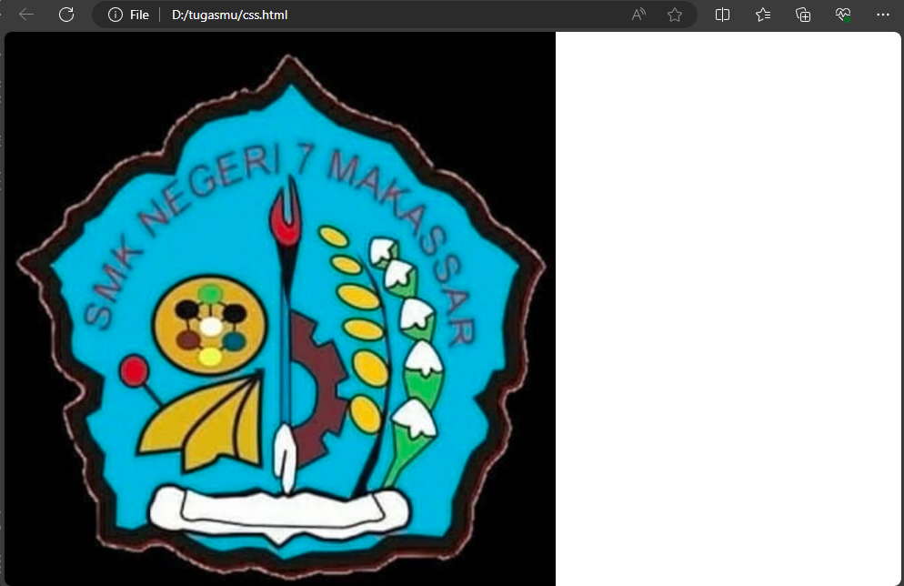
#### after
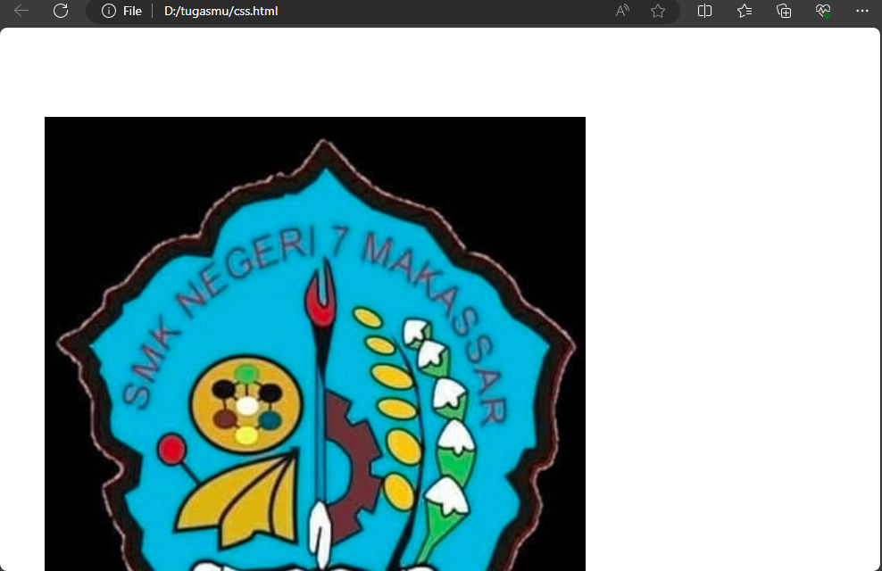
### kesimpulan
Kode CSS di atas menunjukkan bahwa gambar latar belakang pada halaman HTML akan diposisikan pada koordinat (50 piksel dari kiri, 100 piksel dari atas) (`background-position: 50px 100px;`).
Jadi, kesimpulan dari kode program tersebut adalah bahwa gambar latar belakang pada halaman HTML akan diposisikan pada koordinat (50 piksel dari kiri, 100 piksel dari atas).

# font
## Font-size
### penjelasan
`font-size` adalah properti CSS yang digunakan untuk mengatur ukuran teks pada elemen. Properti ini menentukan ukuran dari huruf atau teks yang akan ditampilkan.
### kode program
```css
p {
  font-size: 65px;
}
```
### hasil
#### before
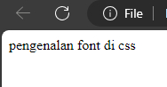
#### after
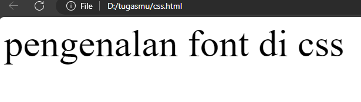
### kesimpulan
Kode program di atas menunjukkan bahwa semua teks di dalam elemen `<p>` akan memiliki ukuran font sebesar 65 piksel (`font-size: 65px;`).
Jadi, kesimpulan dari kode program tersebut adalah bahwa semua teks di dalam elemen `<p>` akan ditampilkan dengan ukuran font sebesar 65 piksel.
## Font-style
### penjelasan
`font-style` adalah properti CSS yang digunakan untuk mengubah gaya huruf teks pada elemen HTML. Properti ini dapat digunakan untuk memberikan efek miring (italic) pada teks.
Nilai yang dapat diberikan pada properti `font-style` antara lain:
- `normal`: Menetapkan gaya huruf normal (tidak miring).
- `italic`: Menetapkan gaya huruf miring (italic).
- `oblique`: Mirip dengan `italic`, tetapi cenderung lebih langsung ke depan daripada miring.
### kode program
```css
p {
 font-style: italic;
}
```
### hasil
#### before

#### after
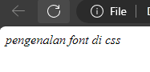
### kesimpulan
Kode program di atas menunjukkan bahwa teks di dalam elemen `<p>` akan memiliki gaya huruf miring (`italic`). Ini berarti teks di dalam elemen `<p>` akan ditampilkan dalam gaya huruf miring.
Jadi, kesimpulan dari kode program tersebut adalah bahwa semua teks di dalam elemen `<p>` akan ditampilkan dalam gaya huruf miring.
## Font-weight
### penjelasan
`font-weight` adalah properti CSS yang digunakan untuk mengatur ketebalan (berat) teks pada elemen. Properti ini mengontrol seberapa tebal atau tipis teks akan ditampilkan. Berikut adalah beberapa nilai umum yang bisa digunakan untuk `font-weight`:
1. `normal`: Menetapkan teks dengan berat normal.
2. `bold`: Menetapkan teks dengan berat tebal.
3. `lighter`: Menetapkan teks dengan berat lebih ringan dari teks normal.
4. `bolder`: Menetapkan teks dengan berat lebih tebal dari teks normal.
### kode program
```css
p {
 font-weight: bold;
}
```
### hasil
#### before

#### after
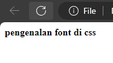
### kesimpulan
Kode program di atas menunjukkan bahwa teks di dalam elemen `<p>` akan ditampilkan dengan tebal (`font-weight: bold`). Ini berarti teks di dalam elemen `<p>` akan memiliki ketebalan yang lebih besar dari teks biasa.
Jadi, kesimpulan dari kode program tersebut adalah bahwa semua teks di dalam elemen `<p>` akan ditampilkan dengan tebal.
## Font-family
### penjelasan
`font-family` adalah properti CSS yang digunakan untuk menentukan jenis font atau jenis font yang akan digunakan untuk teks di dalam elemen HTML. Properti ini memungkinkan Anda untuk menentukan satu atau beberapa jenis font yang akan digunakan, serta memprioritaskan urutan jika font yang pertama tidak tersedia.
Contoh penggunaan `font-family`:
- `Arial` adalah jenis font yang pertama akan digunakan. Jika font Arial tidak tersedia, maka CSS akan mencari jenis font berikutnya dalam daftar.
- `sans-serif` adalah jenis font cadangan jika Arial tidak tersedia. Jenis font ini merupakan salah satu dari kategori font tanpa serif (tanpa dekoratif) yang lebih mudah dibaca di layar.
### kode program 
```css
p {
  font-family: Arial, sans-serif;
}
```
### hasil
#### before

#### after
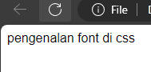
### kesimpulan
Kode program di atas menunjukkan bahwa teks di dalam elemen dengan tag `<p>` akan ditampilkan dengan jenis `font Arial`, jika font tersebut tersedia. Jika Arial tidak tersedia, maka jenis `font sans-serif` akan digunakan sebagai alternatif.
Jadi, kesimpulan dari kode program tersebut adalah bahwa teks di dalam elemen `<p>` akan ditampilkan dengan jenis `font Arial` jika tersedia, dan jika tidak tersedia, `jenis font sans-serif` akan digunakan sebagai alternatif.
# Tantangan Box-Model
### kode program
```css
p {
  font-size: 75px;
  font-family: "times new roman";
  margin-top: 150px;
  margin-bottom: 100px;
  margin-left: 150px;
  margin-right: 50px;
  font-style: italic;
  color: aliceblue;
}
img {
  margin-right: 200px;
  margin-top: -50px;
  border: 10px;
  border-radius: 1500px 1500px;
}
button {
  background-color: #5e2b5e;
  width: 150px;
  height: 50px;
  border-width: 5px;
  margin-left: 400px;
  color: white;
  border-color: white;
}
```
### hasil
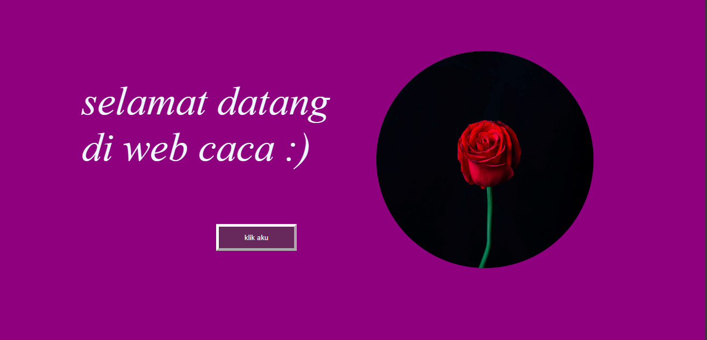
### penjelasan
- Bagian CSS untuk `p` (paragraf):
`font-size: 75px;` - Menentukan ukuran font menjadi 75 piksel.
`font-family: "times new roman";` - Menentukan jenis font menjadi "Times New Roman".
`margin-top: 150px;` - Memberikan margin atas sebesar 150 piksel.
`margin-bottom: 100px;` - Memberikan margin bawah sebesar 100 piksel.
`margin-left: 150px;` - Memberikan margin kiri sebesar 150 piksel.
`margin-right: 50px;` - Memberikan margin kanan sebesar 50 piksel.
`font-style: italic;` - Menentukan gaya font menjadi italic (miring).
`color: aliceblue;` - Menentukan warna teks menjadi aliceblue (biru muda).
- Bagian CSS untuk `img` (gambar):
`margin-right: 200px;` - Memberikan margin kanan sebesar 200 piksel.
`margin-top: -50px;` - Memberikan margin atas sebesar -50 piksel (menggeser ke atas).
`border: 10px;` - Memberikan border (garis pinggir) sebesar 10 piksel tanpa jenis atau warna yang spesifik.
`border-radius: 1500px 1500px;` - Memberikan radius sudut border sebesar 1500 piksel (membuatnya terlihat bulat).
- Bagian CSS untuk `button` (tombol):
`background-color: #5e2b5e;` - Memberikan warna latar belakang tombol menjadi #5e2b5e.
`width: 150px;` - Menentukan lebar tombol sebesar 150 piksel.
`height: 50px;` - Menentukan tinggi tombol sebesar 50 piksel.
`border-width: 5px;` - Menentukan lebar border tombol sebesar 5 piksel.
`margin-left: 400px;` - Memberikan margin kiri sebesar 400 piksel.
`color: white;` - Menentukan warna teks di dalam tombol menjadi putih.
`border-color: white;` - Menentukan warna border tombol menjadi putih.
### Kesimpulan:
- Kode CSS di atas digunakan untuk mengatur tampilan dari elemen-elemen HTML `p` (paragraf), `img` (gambar), dan `button` (tombol).
- Paragraf akan memiliki font ukuran besar (75px) dengan jenis font Times New Roman, warna teks biru muda, margin yang berbeda-beda di setiap sisi, dan gaya font italic.
- Gambar akan memiliki margin kanan yang cukup besar (200px), margin atas yang sedikit digeser ke atas (-50px), border (garis pinggir) sebesar 10 piksel tanpa jenis atau warna yang spesifik, serta radius sudut border yang besar sehingga terlihat bulat.
- Tombol akan memiliki latar belakang berwarna ungu tua (#5e2b5e), lebar dan tinggi yang sudah ditentukan, border lebar 5 piksel, margin kiri yang cukup besar (400px), teks putih, dan border putih.
# Box-Model
## border
### penjelasan
Border (batas) dalam CSS adalah garis yang mengelilingi suatu elemen HTML. Border dapat digunakan untuk memberikan tampilan visual yang jelas dan terpisah antara elemen-elemen di dalam halaman web.
Ada tiga properti utama yang dapat digunakan untuk mengatur border suatu elemen:
1. `border-width`: Mengatur lebar border.
2. `border-style`: Mengatur jenis atau gaya border, seperti solid, dashed, dotted, double, dsb.
3. `border-color`: Mengatur warna border.
4. `boder-radius`: membuat sudut elemen HTML menjadi melengkung daripada tajam.
### kode program
```css
button {
border-radius: 150px;
border-color :brown;
}
```
### hasil
### before
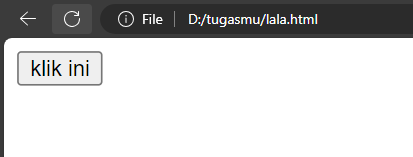
### after
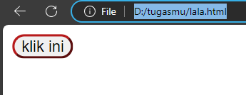
### kesimpulan
kesimpulan kode tersebut `div { border-color: red; }` adalah bahwa semua elemen `<div>` pada halaman web akan memiliki border dengan warna merah.
Dengan kode tersebut, setiap elemen `<div>` akan memiliki border dengan lebar default (biasanya 1 piksel), gaya default (biasanya solid), namun warna bordernya akan diatur menjadi merah. Ini berarti elemen `<div>` akan memiliki garis pinggiran berwarna merah mengelilingi seluruh elemennya.
## Margin
### penjelasan
Margin dalam CSS adalah ruang kosong di sekeliling elemen HTML yang digunakan untuk mengatur jarak antara elemen dengan elemen lainnya atau dengan batas-batas luar halaman web.
Ada empat properti margin yang dapat digunakan:
1. `margin-top`: Mengatur jarak atas elemen.
2. `margin-right`: Mengatur jarak kanan elemen.
3. `margin-bottom`: Mengatur jarak bawah elemen.
4. `margin-left`: Mengatur jarak kiri elemen.
### kode program
```css
button {
    border-color: lightcoral;
    border-width: 10px;
    border-style: solid;
}
```
### hasil
#### before
.png)
)
#### after
.png)

### kesimpulan
Kesimpulan dari kode CSS `div { margin-right: 200px; }` adalah bahwa semua elemen `<div>` pada halaman web akan memiliki margin sebesar 200 piksel di sisi kanan.
Dengan kode tersebut, setiap elemen `<div>` akan memiliki ruang kosong (margin) sebesar 200 piksel di sisi kanan, yang berarti elemen-elemen tersebut akan terpisah dengan elemen lain di sebelah kanannya sejauh 200 piksel. Ini akan memengaruhi tata letak (layout) dari elemen-elemen `<div>` tersebut dalam halaman web.
## Padding
### penjelasan
`padding` digunakan dalam CSS untuk menentukan ruang kosong di sekeliling konten suatu elemen HTML. Properti `padding` dapat diatur secara terpisah untuk setiap sisi elemen, yaitu atas (top), kanan (right), bawah (bottom), dan kiri (left).
Properti `padding` digunakan dalam CSS untuk menentukan ruang kosong di sekeliling konten suatu elemen HTML. Properti `padding` dapat diatur secara terpisah untuk setiap sisi elemen, yaitu atas (top), kanan (right), bawah (bottom), dan kiri (left).
Ini berarti elemen yang diatur akan memiliki padding sebagai berikut:
- `padding-left: 10px;` : Padding sebesar 10 piksel di sisi kiri elemen.
- `padding-bottom: 10px;` : Padding sebesar 10 piksel di sisi bawah elemen.
- `padding-right: 10px;` : Padding sebesar 10 piksel di sisi kanan elemen.
- `padding-top: 10px;` : Padding sebesar 10 piksel di sisi atas elemen.
### kode program
```css
button {
padding-right: 10px;
}
```
### hasil
### before

### after
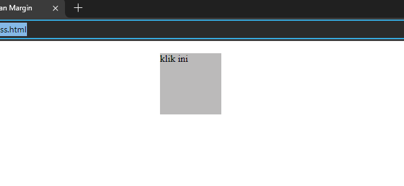
### kesimpulan
Kesimpulan dari kode CSS `div { padding-right: 10px; }` adalah bahwa semua elemen `<div>` pada halaman web akan memiliki padding sebesar 10 piksel di sisi kanan.
Dengan kode tersebut, setiap elemen `<div>` akan memiliki ruang kosong 10 piksel di sisi kanan, yang berarti konten di dalam elemen tersebut akan tergeser ke kiri sejauh 10 piksel dari batas kanan elemen.
Jadi, setiap elemen `<div>` akan memiliki padding sebesar 10 piksel di sisi kanan elemen.
# Transform
## Penjelasan
Transformasi CSS adalah kumpulan properti yang memungkinkan Anda untuk mengubah tampilan elemen HTML tanpa mengubah posisi dalam dokumen. Transformasi ini memungkinkan perubahan seperti translasi (pemindahan), rotasi, penskalaan (perbesaran atau perkecilan), dan kemiringan elemen.
## Kode Program
  ```css
.box-item-1:hover {
    transform: scale(1.0);
```
## kesimpulan 
CSS di atas tidak sepenuhnya lengkap, namun jika diambil sebagai contoh sederhana, itu mengatakan bahwa ketika elemen dengan kelas `.box-item-1` dihover, maka transformasi `scale` akan diterapkan dengan faktor skala `1.0`.
Namun, `scale(1.0)` sebenarnya tidak akan mengubah ukuran elemen, karena nilai `1.0` sama dengan ukuran aslinya. Jadi, dalam kasus ini, hover tidak akan memberikan efek visual apapun pada elemen yang dipilih.
### before
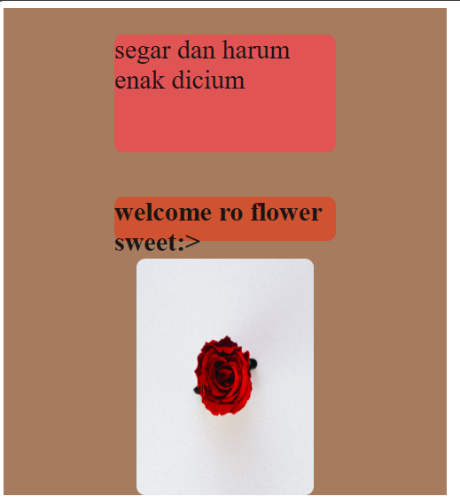
### after
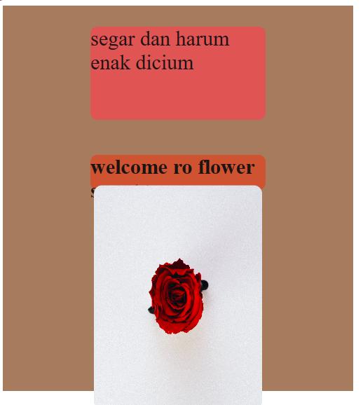
# Transision
## penjelasan 
Transition CSS adalah teknik dalam _web_ desain untuk melakukan perubahan properti pada elemen _web_ yang berlangsung selama interval waktu tertentu. Dengan kata lain, transisi membuat perubahan properti berlangsung secara bertahap, dari satu keadaan ke keadaan lain selama periode yang ditentukan (bukan terjadi seketika).
Berikut beberapa properti kunci yang bisa kamu gunakan dengan _transition_ CSS:
`transition-property`: Menentukan elemen mana dalam css yang akan mengalami transisi.
`tarnsition-duration`:Mengatur durasi transisi,menentukan berapa titik selama efek transisi berlangsung.
`transition-delay`:Menentukan jeda waktu sebelum transisi dimulai,memberikan kontrol atas alur interaksi pengguna.
`transition-timing-function`:Mengatur kecepatan transisi di berbagai titik selama prosesnya menggunakan fungsi waktu.
## contoh program
```css
button {
  width: 100px;
  height: 100px;
  background: red;
  transition: width 2s, height 2s, transform 2s;
}
button:hover {
    transform: rotate(180deg);
}
```
## hasil
### before
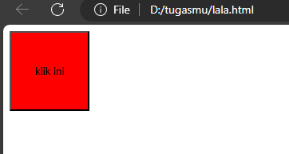
### after
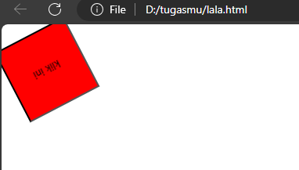
## kesimpulan
Jadi, dengan kode tersebut, tombol akan memperbesar dirinya sendiri secara halus selama 2 detik ketika dimuat atau ketika properti `width` atau `height` diubah. Ketika kursor berada di atas tombol, tombol akan berputar 180 derajat dengan efek transisi yang juga berlangsung selama 2 detik.
# Tantangan Transition
## Kode Program
```html
<!DOCTYPE html>
<html>
<head>
  <title>tantangan transition</title><link rel="stylesheet" href="transisi.css">
</head>
<body>
<div class="container">
  <div>
    
    <p class="box-2"> Selamat Datang <br><b>di web smkn 7 makassar !</b>
      <p>
      </div>
<button> klik saya </button>
</div>
</body>
</html>
```

```css
  .ody {
background-color: rgb(45, 178, 255);
width: 100%;
}

.container {
display: contents;
align-items: flex-end;
flex-direction: row;
justify-content: space-around;
 }

.box-2 {
font-size: 75px;
font-family: 'arial';
margin-top: 150px;
margin-bottom: 100px;
margin-left: 50px;
margin-right: 100px;
color: rgb(104, 104, 104);
}

.box-1 {
margin-right: 200px;
margin-top: -30px;
border: 10px solid pl;
border-radius: 1500px 1500px;
}

 button {
background-color: lightblue;
width: 150px;
height: 50px;
border-width: 2px;
color: rgb(138, 138, 229);
border-color: rgba(243, 107, 182, 0.685);
margin-bottom: 20px;
margin-left: 400px;
}

button:hover {
background-color: lightcyan;
font-weight: bolder;
transition: all 0.3s ease-in;
}
```

### Hasil
![[css58.png]]css58.png)
### penjelasan
**HTML** : 
- `<html>`: Tag ini menandai awal dari dokumen HTML.
- `<head>`: Tag ini berisi informasi tentang dokumen, seperti judul dan gaya.
- `<title>`: Tag ini digunakan untuk memberikan judul pada halaman web.
- `<style>`: Tag ini digunakan untuk menyisipkan aturan gaya CSS di dalam dokumen HTML.
- `.body`: Ini adalah selector yang seharusnya adalah ".ody" untuk elemen dengan kelas "ody".
- `.container`: Ini adalah selector untuk elemen dengan kelas "container". Properti `display: contents;` menghilangkan kotak yang mengelilingi isi elemen, `align-items: flex-end;` mengatur elemen dalam container agar terletak di bagian bawah, `flex-direction: row;` mengatur tata letak elemen dalam container secara horizontal, dan `justify-content: space-around;` mengatur ruang sekitar elemen di sekitar container agar merata.
- `.box-2`: Ini adalah selector untuk elemen dengan kelas "box-2". Properti seperti `font-size`, `font-family`, `margin`, dan `color` mengatur tampilan teks dalam elemen tersebut.
- `.box-1`: Ini adalah selector untuk elemen dengan kelas "box-1". Properti seperti `margin-right`, `margin-top`, `border`, dan `border-radius` mengatur tampilan dan posisi elemen tersebut.
- `<button>`: Tag ini digunakan untuk membuat tombol di dalam halaman web. Properti seperti `background-color`, `width`, `height`, `border-width`, `color`, `border-color`, `margin-bottom`, dan `margin-left` mengatur tampilan tombol.
- `button:hover`: Ini adalah aturan gaya yang diterapkan saat pointer mouse berada di atas tombol. Properti `background-color`, `font-weight`, dan `transition` mengatur tampilan tombol saat dihover.

**CSS** : 
- `.body`: Ini adalah seharusnya `.body` tetapi kemungkinan adalah typo dan seharusnya `.body` yang merujuk pada elemen `<body>` dalam dokumen HTML. Properti `background-color: rgb(45, 178, 255);` mengatur warna latar belakang elemen body menjadi biru muda, dan `width: 100%;` mengatur lebar elemen body menjadi 100% dari lebar layar.
- `.container`: Ini adalah selector untuk elemen dengan kelas "container". Properti `display: contents;` mengatur elemen container untuk tidak mempengaruhi tata letak elemen-elemen di dalamnya, `align-items: flex-end;` mengatur elemen-elemen di dalam container untuk diatur pada bagian bawah container, `flex-direction: row;` mengatur tata letak elemen-elemen di dalam container secara horizontal, dan `justify-content: space-around;` mengatur elemen-elemen di dalam container untuk didistribusikan secara merata dengan ruang kosong di antara mereka.
- `.box-2`: Ini adalah selector untuk elemen dengan kelas "box-2". Properti `font-size: 75px;` mengatur ukuran teks menjadi 75 piksel, `font-family: 'arial';` mengatur jenis font teks menjadi Arial, `margin-top: 150px;` mengatur jarak atas elemen dari elemen sebelumnya menjadi 150 piksel, `margin-bottom: 100px;` mengatur jarak bawah elemen dari elemen setelahnya menjadi 100 piksel, `margin-left: 50px;` mengatur jarak kiri elemen dari batas elemen yang mengandungnya menjadi 50 piksel, `margin-right: 100px;` mengatur jarak kanan elemen dari batas elemen yang mengandungnya menjadi 100 piksel, dan `color: rgb(104, 104, 104);` mengatur warna teks menjadi abu-abu.
- `.box-1`: Ini adalah selector untuk elemen dengan kelas "box-1". Properti `margin-right: 200px;` mengatur jarak kanan elemen dari batas elemen yang mengandungnya menjadi 200 piksel, `margin-top: -30px;` mengatur jarak atas elemen dari elemen sebelumnya menjadi -30 piksel, `border: 10px solid pl;` mengatur tepian elemen dengan lebar 10 piksel dan warna yang belum ditentukan, dan `border-radius: 1500px 1500px;` mengatur sudut melengkung pada elemen dengan radius horizontal 1500 piksel dan radius vertikal 1500 piksel.
- `button`: Ini adalah selector untuk elemen `<button>`. Properti `background-color: lightblue;` mengatur warna latar belakang tombol menjadi biru muda, `width: 150px;` mengatur lebar tombol menjadi 150 piksel, `height: 50px;` mengatur tinggi tombol menjadi 50 piksel, `border-width: 2px;` mengatur lebar tepian tombol menjadi 2 piksel, `color: rgb(138, 138, 229);` mengatur warna teks pada tombol menjadi biru muda, `border-color: rgba(243, 107, 182, 0.685);` mengatur warna tepian tombol dengan warna yang belum ditentukan, `margin-bottom: 20px;` mengatur jarak bawah tombol dari elemen sebelumnya menjadi 20 piksel, dan `margin-left: 400px;` mengatur jarak kiri tombol dari batas elemen yang mengandungnya menjadi 400 piksel.
- `button:hover`: Ini adalah aturan yang diterapkan ketika pengguna mengarahkan kursor ke tombol (`:hover`). Properti `background-color: lightcyan;` mengatur warna latar belakang tombol menjadi sian muda, `font-weight: bolder;` mengatur teks pada tombol menjadi lebih tebal, dan `transition: all 0.3s ease-in;` mengatur transisi animasi dengan durasi 0,3 detik dan fungsi animasi "ease-in" untuk properti yang berubah saat pengguna mengarahkan kursor ke tombol.
### kesimpulan
- Kode HTML dimulai dengan tag `<html>` yang menandakan awal dari dokumen HTML.
- Bagian `<head>` digunakan untuk menghubungkan kode CSS dan menyertakan judul halaman web.
- Di dalam tag `<style>` di dalam bagian `<head>`, diberikan gaya CSS untuk mengatur tampilan elemen-elemen dalam halaman web.
- Elemen `<body>` digunakan untuk mengelompokkan konten utama halaman web.
- Dalam elemen `<body>`, terdapat sebuah div dengan kelas "container" yang digunakan untuk mengelompokkan elemen-elemen lainnya.
- Di dalam div dengan kelas "container", terdapat sebuah div lagi yang berisi elemen `` dengan kelas "box-1". Elemen ini menampilkan sebuah gambar dengan atribut src yang menunjukkan lokasi gambar, width dan height yang mengatur ukuran gambar, dan align yang mengatur penempatan gambar ke kanan.
- Di dalam div dengan kelas "container", terdapat juga sebuah elemen `<p>` dengan kelas "box-2". Elemen ini menampilkan teks "Selamat Datang" diikuti oleh tag `<br>` untuk membuat baris baru, dan teks "<b>di web caca !</b>". Tag `<b>` digunakan untuk membuat teks menjadi tebal.
- Setelah itu, terdapat sebuah elemen `<button>` yang menampilkan teks "klik saya".
- Akhirnya, kode HTML ditutup dengan tag `</html>`.
Gaya CSS yang diberikan mengatur tampilan elemen-elemen tersebut dengan menggunakan kelas-kelas yang ditentukan. Beberapa properti yang diatur antara lain warna latar belakang, lebar, tinggi, margin, dan warna teks. Terdapat juga pengaturan gaya saat pengguna mengarahkan kursor ke tombol menggunakan pseudo-class `:hover` dan properti `transition` untuk animasi transisi.
Dengan demikian, kesimpulan dari kode tersebut adalah sebuah halaman web sederhana yang menampilkan gambar, teks, dan tombol dengan tata letak dan gaya tertentu.
# flexbox
## flex container
### penjelasan 
`flexbox` yaitu memberikan container kemampuan untuk mengatur panjang, lebar, dan posisi item-item yang berada di dalamnya agar memaksimalkan ruang yang ada. Pengaturan ini sangat penting bagi seorang `frontend developer` untuk membuat sebuah `website` yang nyaman dilihat di berbagai `device` dengan berbagai macam resolusi.
property container Flexbox : 
`flex-direction` :Menentukkan arah (direction) yang akan diberlakukan untuk item-item yang ada pada container flexbox.
`flex-wrap` :Digunakan untuk mendefinisikan bahwa elemen item di dalam container flexbox tidak harus disejajarkan dalam satu baris.
`justify-content` :Digunakan untuk mensejajarkan item-item diantara flexbox agar container dari flexbox tersebut bisa mendistribusikan ruang kosong yang tersisa ketika item flex dalam satu baris tersebut tidak flexsibel atau meskipun flexsibel tapi sudah mencapai batas ukuran maksimum.
`align-items` :Mendefinisikan bagaimana item-item pada container flex tersebut diletakkan sepanjang garis tegak lurus pada sumbu utama (cross-axis).
`align-content` :Digunakan untuk mensejajarkan garis flex container ketika ada ruang kosong secara garis tegak lurus pada sumbu utama (cross-axis).
### contoh program
```css
.container {
    display: flex;
    justify-content: space-around;
    align-items: center;
    height: 300px;
    background-color: #9e2d2d;
  }
```
### hasil
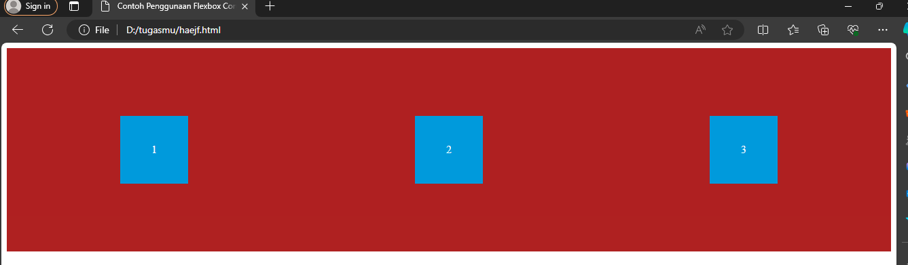
### kesimpulan
`display: flex;`: Properti ini mengubah elemen dengan kelas `.container` menjadi sebuah container Flex. Dengan menggunakan `display: flex;`, elemen `.container` akan memperlakukan anak-anaknya sebagai elemen Flex, yang memberikan kontrol lebih lanjut atas tata letak mereka.
`justify-content: space-around;`: Properti ini mengatur cara anak-anak di dalam container Flex akan didistribusikan secara horizontal. Dalam hal ini, `space-around` akan memberikan ruang yang sama di antara setiap anak, dan juga di sebelah kiri dan kanan elemen terluar.    
`align-items: center;`: Properti ini mengatur cara anak-anak di dalam container Flex akan didistribusikan secara vertikal. Dengan nilai `center`, semua anak-anak akan diposisikan secara vertikal di tengah container.
`height: 300px;`: Properti ini menentukan tinggi dari elemen dengan kelas `.container`. Dalam contoh ini, tinggi container ditetapkan sebesar 300 piksel.
`background-color: #9e2d2d;`: Properti ini memberikan warna latar belakang pada elemen dengan kelas `.container`. Di sini, warna yang diberikan adalah merah gelap (#9e2d2d).
## Flex item
### penjelasan 
`Item` biasanya adalah elemen-anak atau elemen di dalam container. Setiap item flex memiliki properti yang dapat digunakan untuk mengontrol ukuran dan urutan item tersebut.
### contoh program
```css
.item {
    width: 100px;
    height: 100px;
    background-color: #3498db;
    color: white;
    text-align: center;
    line-height: 100px;
  }
```
### hasil

### kesimpulan
`width: 100px;`: Properti ini menentukan lebar dari setiap item dalam container. Dalam contoh ini, setiap item akan memiliki lebar 100 piksel.    
`height: 100px;`: Properti ini menentukan tinggi dari setiap item dalam container. Dalam contoh ini, setiap item akan memiliki tinggi 100 piksel.    
`background-color: #3498db;`: Properti ini memberikan warna latar belakang untuk setiap item. Dalam contoh ini, warna latar belakang setiap item adalah biru (#3498db).    
`color: white;`: Properti ini menentukan warna teks di dalam setiap item. Dalam contoh ini, warna teks diatur sebagai putih, sehingga kontras dengan latar belakang biru.
`text-align: center;`: Properti ini memposisikan teks di dalam setiap item secara horizontal di tengah. Dalam contoh ini, teks di dalam setiap item akan berada di tengah secara horizontal.
`line-height: 100px;`: Properti ini menentukan tinggi baris teks di dalam setiap item. Dalam contoh ini, tinggi baris diatur sama dengan tinggi item, sehingga teks akan berada di tengah secara vertikal.
# Pseudo class
## Hover
### penjelasan
`box:hover`: Ini adalah pemilih CSS. Ini menargetkan elemen dengan kelas "box" saat itu dihover.    
`background-color: #e41111;`: Ini adalah properti CSS yang mengatur warna latar belakang elemen. Dalam kasus ini, saat elemen ".box" dihover, warna latar belakang akan berubah menjadi "#e41111" (merah).
`color: #fff;`: Ini adalah properti CSS yang mengatur warna teks elemen. Dalam kasus ini, saat elemen ".box" dihover, warna teks akan berubah menjadi "#fff" (putih).
### Kode Program
 ```css
 .box {
  width: 200px;
  height: 100px;
  background-color: #f0f0f0;
  border: 1px solid #ccc;
  text-align: center;
  line-height: 100px;
}
.box:hover {
  background-color: #e41111;
  color: #fff;
}
```
### Hasil
#### Before
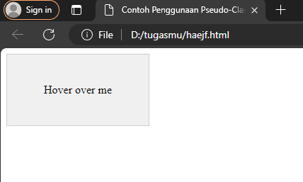

#### After
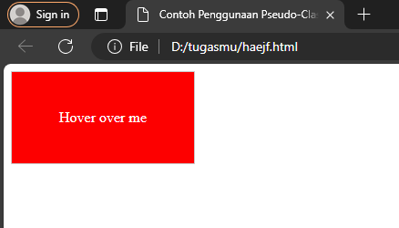

### Kesimpulan
Jadi, saat pengguna mengarahkan kursor ke elemen dengan kelas ".box", latar belakangnya akan berubah menjadi merah (#e41111) dan warna teksnya akan berubah menjadi putih (#fff).

## Active
###  penjelasan
`button active`: adalah pseudo-class selector yang menargetkan tombol (button) ketika tombol tersebut sedang dalam keadaan "active", atau tombol sedang ditekan. 
`color`: yellow;: Properti memberikan warna kuning pada teks ketika tombol sedang active atau tombol sedang ditekan. 
### Kode program
```css
 .button {
    display: inline-block;
    padding: 10px 20px;
    background-color: #007bff;
    color: #fff;
    text-decoration: none;
    border-radius: 5px;
  }
  .button:active {
    background-color: #0056b3;
  }
```
### Hasil
#### Before
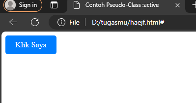
#### After
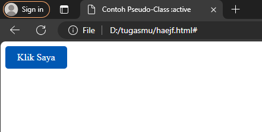
### Kesimpulan
background akan berganti warna menjadi biru tua jika ditekan. 
## VISITED
### Penjelasan
Visited adalah pseudo class yang digunakan untuk menentukan gaya pada elemen yang telah di kunjungi oleh user. umumnya digunakan untuk merubah tampilan tautan yang di klik agar user bisa membedakan mana link yang sudah dikunjungi dan yang belum dikunjungi

### Kode Program
```html
<html>
<head>
<title>Contoh Background Tautan yang Dikunjungi</title>
<style>
  a {
    color: blue;
    text-decoration: none;
  }
  a:visited {
    background-color: lightgray;
    color: purple;
  }
</style>
</head>
<body>
<a href="https://www.example.com">Tautan ke Example.com</a>
</body>
</html>
```
### Hasil
Before
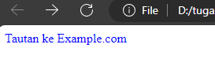

After
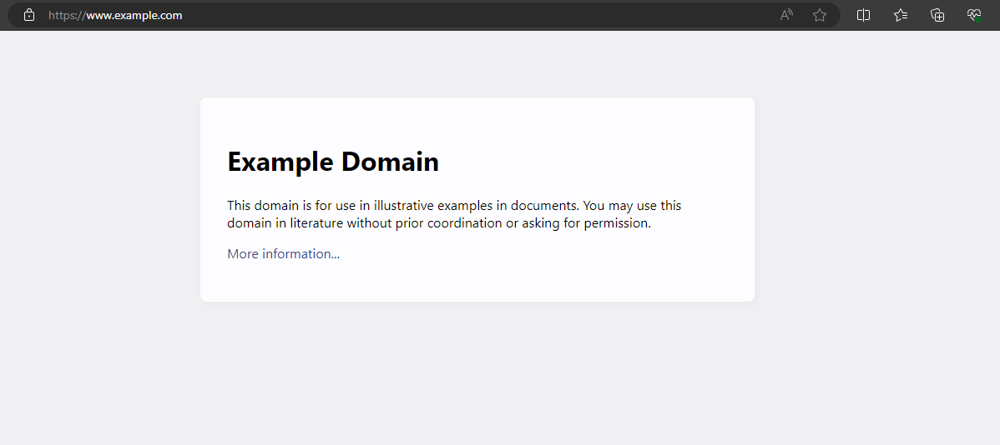

### Kesimpulan
Visited pseudo Class ini digunakan untuk memberikan gaya pada tampilan link yang sudah dikunjungi.
## LINK
### Penjelasan
Link Pseudo Class yang digunakan untuk memberikan gaya pada elemen/link yang belum dikunjungi, kebalikannya dari Visited.
### Kode Program
```html
<!DOCTYPE html>
<html>
<head>
<meta charset="UTF-8">
<meta name="viewport" content="width=device-width, initial-scale=1.0">
<title>Contoh Pseudo-Class :link</title>
<style>
  a:link {
    color: blue;
    text-decoration: none;
  }
</style>
</head>
<body>
<a href="https://www.example.com">Tautan ke Example.com</a>
</body>
</html>

```
### Hasil
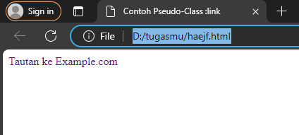
### Kesimpulan
Jadi fungsi dari Pseudo Class link ini memberikan gaya pada tautan yang belum dikunjungi.
# Position

## Position relativ
### Penjelasan
`position: relative` adalah properti CSS yang digunakan untuk menetapkan posisi elemen pada halaman web relatif terhadap posisinya sendiri.
### Kode program
```Css
   .container {
    width: 300px;
    height: 200px;
    border: 1px solid red;
    position: relative;
  }
  .box {
    width: 50px;
    height: 50px;
    background-color: blue;
    border: 1px solid white;
    position: relative;
    top: 50px;
    left: 50px;
  }
```
### Hasil
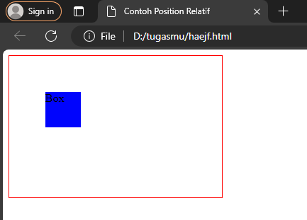
### Kesimpulan
Dengan demikian, elemen `.box` akan ditempatkan di dalam elemen `.container`, dan karena keduanya memiliki posisi relatif, properti `top` dan `left` pada `.box` akan menggesernya 50 piksel dari atas dan 50 piksel dari kiri relatif terhadap posisi normalnya di dalam `.container`.
## Position absolute
### Penjelasan
`position: absolute` akan dikeluarkan dari normal flow, yang berarti elemen tersebut tidak akan memengaruhi posisi elemen lain di halaman.
### Kode program
```css
.container {
    position: relative;
    width: 400px;
    height: 300px;
    border: 1px solid black;
  }
  .box {
    position: absolute;
    top: 50px;
    left: 50px;
    width: 200px;
    height: 100px;
    background-color: white;
    border: 1px solid red;
  }
```
### Hasil
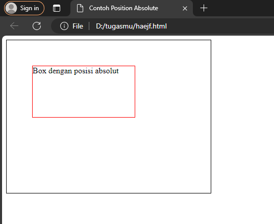
### Kesimpulan
Dengan demikian, aturan gaya di atas akan membuat elemen dengan kelas ".box" ditempatkan secara absolut di dalam elemen dengan kelas ".container". Elemen ".container" memiliki lebar 400 piksel dan tinggi 300 piksel dengan border hitam 1 piksel. Elemen ".box" memiliki lebar 200 piksel, tinggi 100 piksel, latar belakang putih, dan border merah 1 piksel. Elemen ".box" akan ditempatkan 50 piksel dari atas dan 50 piksel dari kiri elemen ".container".
## Position fixed
### Penjelasan
 `position: fixed` adalah properti CSS yang digunakan untuk menetapkan posisi elemen pada halaman web tetap dalam posisi tertentu di layar
### Kode program
```css
  .fixed-element {
    position: fixed;
    top: 20px;
    left: 20px; 
    width: 200px;
    height: 100px;
    background-color: #f0f0f0;
    border: 1px solid #ccc;
    padding: 10px;
  }
```
### Hasil
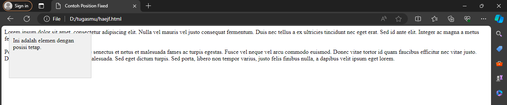
### Kesimpulan
Jadi, aturan gaya di atas akan membuat elemen dengan kelas ".fixed-element" ditempatkan secara tetap di jendela penampilan dengan jarak 20 piksel dari atas dan 20 piksel dari kiri jendela. Elemen tersebut akan memiliki lebar 200 piksel, tinggi 100 piksel, latar belakang abu-abu muda, border dengan garis abu-abu muda, dan jarak isi sebesar 10 piksel dari tepi border.
## Position sticky
### Penjelasan
Posisi sticky adalah cara efektif untuk mengubah posisi elemen dengan kecil atau sedikit, seperti menyesuaikan posisi elemen dengan kursor atau mengubah posisi elemen dalam layout.
### Kode program
``` Css
.header {
    background-color: #333;
    color: #fff;
    padding: 10px 0;
    text-align: center;
    position: sticky;
    top: 0; 
    z-index: 1000; 
  }
  .content {
    padding: 20px;
    height: 1000px;
  }
```
### Hasl
#### Before
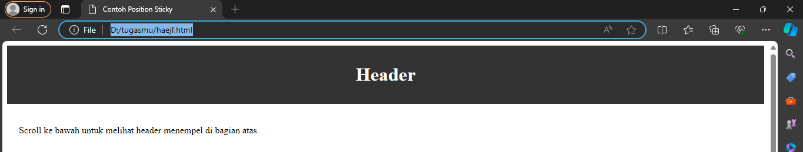
#### After

### Kesimpulan
Jadi, aturan gaya di atas akan memberikan elemen dengan kelas ".header" latar belakang gelap, teks putih, jarak isi, dan teks yang rata tengah. Elemen tersebut juga akan melekat di bagian atas jendela penampilan, memiliki tingkatan tumpukan 1000, dan tidak akan terpengaruh oleh pengguliran halaman. Elemen dengan kelas ".content" akan memiliki jarak isi dan tinggi tertentu sesuai dengan properti yang ditentukan.

# Tantangan Flexbox
## Penjelasan 
`<!DOCTYPE html>`: Ini adalah deklarasi tipe dokumen HTML yang menunjukkan bahwa dokumen ini adalah dokumen HTML5.
`<html lang="en">`: Ini adalah elemen root (akar) dari dokumen HTML. lang="en" menunjukkan bahwa bahasa yang digunakan dalam dokumen adalah bahasa Inggris.
`<head>`: Elemen `<head>` digunakan untuk menyediakan informasi tentang dokumen, seperti judul (title) dan referensi ke file eksternal seperti stylesheet (CSS).
`<title>`: Elemen `<title>` digunakan untuk menentukan judul dokumen yang akan ditampilkan di bilah judul browser.
`<link rel="stylesheet" href="tugasflex.css">`: Elemen `<link>` digunakan untuk menghubungkan dokumen HTML dengan file eksternal CSS. Dalam contoh ini, file CSS yang disebut "tugasflex.css" akan digunakan untuk mengatur tampilan halaman.
`<body bgcolor="purple">`: Elemen `<body>` digunakan untuk mengelilingi konten utama halaman web. bgcolor="purple" adalah atribut yang digunakan untuk mengatur warna latar belakang body menjadi ungu (purple).
`<div class="main-container">`: Elemen `<div>` adalah elemen blok yang digunakan untuk mengelompokkan dan mengatur konten. class="main-container" adalah atribut kelas yang memberikan nama kelas "main-container" pada elemen ini. Kelas ini nantinya dapat digunakan dalam CSS untuk mengatur tampilan elemen ini.
`<div class="hero-container">`: Elemen `<div>` dengan kelas "hero-container" digunakan untuk mengelompokkan konten yang terkait dengan bagian hero atau bagian utama halaman.
`<div class="item p">`: Elemen `<div>` dengan kelas "item p" digunakan untuk mengelompokkan konten dan memberikan atribut kelas "p".
`<p>`: Elemen `<p>` digunakan untuk menampilkan paragraf teks. Di dalam elemen ini, terdapat teks "Selamat Datang" dan "di Web Alya" yang ditampilkan dalam beberapa baris yang dipisahkan oleh tag <br>. Teks "Web Alya" ditampilkan dengan teks tebal menggunakan tag `<b>`.
`<button>`: Elemen `<button>` digunakan untuk membuat tombol. Di sini, tombol ditampilkan dengan teks "klik saya".
`<span class="img">`: Elemen `<span>` digunakan untuk mengelompokkan dan memanipulasi bagian teks atau elemen lainnya dalam dokumen. Di sini, elemen span memiliki atribut kelas "img".
``: Elemen  digunakan untuk menampilkan gambar dalam halaman. Atribut src menentukan sumber gambar (dalam hal ini, "bg.JPG"), sedangkan atribut width dan height mengatur lebar dan tinggi gambar. Atribut align="right" mengatur posisi gambar ke sebelah kanan.
## Kode Program
```html
<!DOCTYPE html>
<html>
<head>
    <title>tantangan flexbox</title>
    <link rel="stylesheet" href="tantangan_flexbox.css">
</head>
<body>
    <div class="container">
        <div>
            
            <p class="box-2"> Selamat Datang <br><b>
            di web Alya !</b>
            <p>
        </div>
        <button> klik saya </button>
    </div>
</body>
</html>
```

```css
body {
    background-color: bisque;
    width: 100%;
}
.container {
    display: contents;
    align-items: flex-end;
    flex-direction: row;
    justify-content: space-around;
}
.box-2 {
    font-size: 75px;
    font-family: 'arial';
    margin-top: 150px;
    margin-bottom: 100px;
    margin-left: 50px;
    margin-right: 100px;  
    color: rgb(82, 82, 82);
}
.box-1 {
    margin-right: 200px;
    margin-top: -30px;  
    border: 10px solid white;
    border-radius: 1500px 1500px;
}
button {
    background-color: lightblue;
    width: 150px;
    height: 50px;
    border-width: 2px;
    color: rgb(138, 138, 229);
    border-color: rgba(73, 134, 240, 0.29);
    margin-bottom: 20px;
    margin-left: 400px;
}
button:hover {
    background-color: lightcyan;
    font-weight: bolder;
}
tolong berikan kesimpulannya
````
## Hasil


## Kesimpulan
-Terdapat sebuah `<div>` dengan kelas "container" yang berperan sebagai wadah utama.
- Di dalam `<div>` tersebut terdapat dua elemen lainnya.
- Elemen pertama adalah sebuah gambar yang ditampilkan menggunakan tag  dengan kelas "box-1".
- Elemen kedua adalah sebuah teks yang ditampilkan menggunakan tag `<p>` dengan kelas "box-2".
- Ada pula sebuah tombol yang ditampilkan menggunakan tag `<button>` di luar div "container".
- Body memiliki latar belakang berwarna "bisque" dan lebar 100% dari viewport.
- Elemen dengan kelas "container" menggunakan properti display: contents; untuk mengubah perilaku tata letak dan mengabaikan elemen wadah tersebut dalam tata letak.
- Properti align-items: flex-end; mengatur elemen di dalam div "container" agar ditampilkan di bagian bawah.
- Properti flex-direction: row; mengatur tata letak elemen di dalam div "container" menjadi horizontal.
- Properti justify-content: space-around; mengatur ruang antara elemen di dalam div "container".
- Kelas "box-2" memiliki properti untuk mengatur ukuran font, margin, dan warna teks.
- Kelas "box-1" memiliki properti untuk mengatur margin, border, dan border radius sehingga menghasilkan bentuk lingkaran.
- Tombol memiliki properti tampilan yang kustom, seperti latar belakang, ukuran, warna teks, dan efek hover.

# Tantangan posision
## kode program
```html
<!DOCTYPE html>
<html>
<head>
    <title>POSITION</title>
</head>
<body>
    <div class="container">
        <div class="box">
            
            <p> </p>
            <p class="item box-2">Saturday, April 27, 2024</p>
            <h1 class="item box-3">The standard chunk of <br>Lorem Ipsum</h1>
            <p class="item box-4">Sed posuere consectetur est at lobortis.<br>Aeneen eu leo quam</p>
            <p class="box-5"><b>Read more </b> </p>
        </div>
    </div>
</body>
</html>
```

```css
 <style>
        .container {
    position: static;
    display: flex;
    flex-direction: column;
    width: 100%;
    height: 580px;
    background-color: rgba(122, 122, 247, 0.628);
}
.box {
    width: 250px;
    height: 350px;
    background-color: white;
    align-items: center;
    align-content: center;
    border-radius: 10px;
    align-self: center;
    margin-top: 150px;
    margin-bottom: 200px;
} 
.item {
    width: 100%;
    color: black;
}
.box-1 {
    height: 225px;
    width: 100%;
    border-radius: 10px 10px 0px 0px;
}
.box-2 {
    font-size: 10px;
    margin-left: 20px;
    margin-top: 20px;
    padding-top: 10px;
    font-family: Arial, Helvetica, sans-serif;
}
.box-3 {
    font-size: 18px;
    margin-left: 20px;
    margin-top: 10px;
    padding-top: 10px;
    font-family: Arial, Helvetica, sans-serif;
}
.box-4 {
    font-size: 11px;
    font-family: Arial, Helvetica, sans-serif;
    margin-left: 20px;
}
.box-5 {
    background-color: rgb(193, 193, 193);
    padding-left: 20px;
    padding-bottom: 10px;
    padding-top: 10px;
    margin-bottom: 90px ;
    font-family: Arial, Helvetica, sans-serif;
    border-radius: 0px 0px 10px 10px;
    font-size: small;
}
.item-1 {
    width: 10px;
    padding-left: 130px;
}
.icon {
   background-color: skyblue;
   position: relative;
   left: 200px;
   bottom: 35px;
   width: 30px;
   height: 30px;
   border-radius: 1500px;
}
    </style>
```

## hasil

## penjelasan 
**HTML** : 
- `<html>`: Tag ini menandai awal dari dokumen HTML.
- `<head>`: Tag ini berisi informasi tentang dokumen, seperti judul.
- `<title>`: Tag ini digunakan untuk memberikan judul pada halaman web.
- `<body>`: Tag ini berisi konten yang akan ditampilkan di halaman web.
- `<div class="container">`: Ini adalah elemen div dengan kelas "container". Elemen ini digunakan sebagai wadah untuk mengelompokkan konten lainnya.
- `<div class="box">`: Ini adalah elemen div dengan kelas "box". Elemen ini digunakan sebagai wadah untuk mengelompokkan konten lainnya.
- ``: Ini adalah elemen img dengan kelas "item" dan "box-1". Elemen ini digunakan untuk menampilkan gambar dengan sumber file "img2.jpg" dan teks alternatif "Gambar".
- `<p> </p>`: Ini adalah elemen p yang berisi elemen img dengan kelas "icon". Elemen ini digunakan untuk menampilkan gambar dengan sumber file "itujo.jpg".
- `<p class="item box-2">Saturday, April 27, 2024</p>`: Ini adalah elemen p dengan kelas "item" dan "box-2". Elemen ini digunakan untuk menampilkan teks "Saturday, April 27, 2024".
- `<h1 class="item box-3">The standard chunk of <br>Lorem Ipsum</h1>`: Ini adalah elemen h1 dengan kelas "item" dan "box-3". Elemen ini digunakan untuk menampilkan teks "The standard chunk of" dengan baris baru dan teks "Lorem Ipsum".
- `<p class="item box-4">Sed posuere consectetur est at lobortis.<br>Aeneen eu leo quam</p>`: Ini adalah elemen p dengan kelas "item" dan "box-4". Elemen ini digunakan untuk menampilkan beberapa paragraf teks.
- `<p class="box-5"><b>Read more </b> </p>`: Ini adalah elemen p dengan kelas "box-5". Elemen ini digunakan untuk menampilkan teks "Read more" yang ditebalkan dan elemen img dengan kelas "item-1" yang menampilkan gambar dengan sumber file "itumo.jpg".

**CSS** : 
- `.container`: Ini adalah selector untuk elemen dengan kelas "container". Properti `position: static;` mengatur posisi elemen sebagai statis, `display: flex;` mengatur elemen sebagai kontainer fleksibel, `flex-direction: column;` mengatur tata letak elemen secara vertikal dalam kolom, `width: 100%;` mengatur lebar elemen menjadi 100% dari lebar kontainer, `height: 580px;` mengatur tinggi elemen menjadi 580 piksel, dan `background-color: rgba(122, 122, 247, 0.628);` mengatur warna latar belakang elemen.
- `.box`: Ini adalah selector untuk elemen dengan kelas "box". Properti seperti `width`, `height`, `background-color`, `align-items`, `align-content`, `border-radius`, `align-self`, `margin-top`, dan `margin-bottom` mengatur tampilan dan posisi elemen tersebut.
- `.item`: Ini adalah selector untuk elemen dengan kelas "item". Properti `width: 100%;` mengatur lebar elemen menjadi 100% dari lebar kontainer, dan `color: black;` mengatur warna teks menjadi hitam.
- `.box-1`: Ini adalah selector untuk elemen dengan kelas "box-1". Properti seperti `height`, `width`, dan `border-radius` mengatur tampilan dan bentuk elemen tersebut.
- `.box-2`, `.box-3`, `.box-4`: Ini adalah selector untuk elemen dengan kelas "box-2", "box-3", dan "box-4". Properti seperti `font-size`, `margin-left`, `margin-top`, `padding-top`, dan `font-family` mengatur tampilan teks dalam elemen-elemen tersebut.
- `.box-5`: Ini adalah selector untuk elemen dengan kelas "box-5". Properti seperti `background-color`, `padding-left`, `padding-bottom`, `padding-top`, `margin-bottom`, `font-family`, `border-radius`, dan `font-size` mengatur tampilan elemen tersebut.
- `.item-1`: Ini adalah selector untuk elemen dengan kelas "item-1". Properti seperti `width` dan `padding-left` mengatur tampilan elemen tersebut.
- `.icon`: Ini adalah selector untuk elemen dengan kelas "icon". Properti seperti `background-color`, `position`, `left`, `bottom`, `width`, `height`, dan `border-radius` mengatur tampilan dan posisi elemen tersebut.

## kesimpulan 
Kode HTML yang Anda berikan merupakan struktur dasar dari sebuah halaman web yang menggunakan gaya CSS yang terdapat di dalam tag `<style>`. Berikut adalah kesimpulan dari kode tersebut:
- Halaman web ini memiliki judul "POSITION" yang ditentukan oleh tag `<title>`.
- Gaya CSS didefinisikan di dalam tag `<style>` di dalam bagian `<head>` dari dokumen HTML.
- Halaman web ini terdiri dari sebuah kontainer dengan kelas "container" yang memiliki tata letak fleksibel dengan arah tata letak vertikal (column).
- Di dalam kontainer tersebut, terdapat sebuah kotak dengan kelas "box" yang memiliki lebar 250 piksel dan tinggi 350 piksel. Kotak ini memiliki latar belakang putih dan ditengah-tengahkan secara horizontal dan vertikal di dalam kontainer.
- Di dalam kotak tersebut, terdapat beberapa elemen dengan gaya yang berbeda. Elemen-elemen ini memiliki kelas "item" yang mengatur lebar mereka menjadi 100% dari lebar kotak dan warna teksnya menjadi hitam.
- Elemen dengan kelas "box-1" adalah sebuah gambar yang memiliki tinggi 225 piksel, lebar 100%, dan memiliki sudut melengkung pada bagian atas.
- Elemen dengan kelas "box-2" adalah sebuah paragraf dengan teks berukuran 10 piksel, memiliki margin kiri 20 piksel, margin atas 20 piksel, dan padding atas 10 piksel. Font yang digunakan adalah Arial, Helvetica, sans-serif.
- Elemen dengan kelas "box-3" adalah sebuah judul (h1) dengan teks berukuran 18 piksel, memiliki margin kiri 20 piksel, margin atas 10 piksel, dan padding atas 10 piksel. Font yang digunakan adalah Arial, Helvetica, sans-serif.
- Elemen dengan kelas "box-4" adalah sebuah paragraf dengan teks berukuran 11 piksel dan menggunakan font Arial, Helvetica, sans-serif. Elemen ini memiliki margin kiri 20 piksel.
- Elemen dengan kelas "box-5" adalah sebuah paragraf dengan latar belakang berwarna abu-abu (rgb(193, 193, 193)). Elemen ini memiliki padding kiri, padding bawah, dan padding atas sebesar 20 piksel. Elemen ini juga memiliki margin bawah sebesar 90 piksel dan sudut melengkung pada bagian bawah.
- Di dalam elemen dengan kelas "box-5", terdapat teks "Read more" yang digarisbawahi dan sebuah gambar dengan kelas "item-1". Gambar ini memiliki lebar 10 piksel dan padding kiri sebesar 130 piksel.
- Terakhir, di dalam elemen dengan kelas "box", terdapat sebuah ikon dengan kelas "icon". Ikon ini memiliki latar belakang berwarna biru langit (skyblue) dan ditempatkan secara relatif dengan posisi yang ditentukan dengan menggunakan properti `left` dan `bottom`. Ikon ini memiliki lebar 30 piksel dan tinggi 30 piksel, serta memiliki sudut melengkung yang sangat besar sehingga membuatnya terlihat seperti lingkaran.

Kode HTML ini menggambarkan sebuah halaman web dengan tampilan kotak yang menampilkan gambar, teks, dan ikon dengan tata letak dan gaya tertentu.